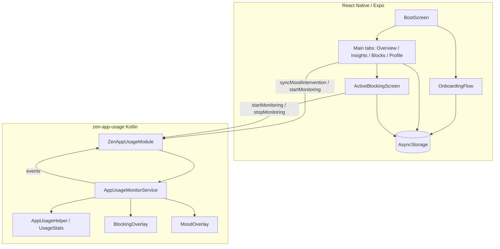

# Zen Sweep

Mood-aware digital wellbeing for Android. When you reach for a trap app, Zen Sweep can start a **timed block** or a **mood pause** (breathing / family-connect prototype) so scrolling does not take over.

**How to run this project:** see [`SOFTWARE_INSTRUCTIONS.md`](./SOFTWARE_INSTRUCTIONS.md) (clone, install, device permissions, demo steps).

**Video demo:** [https://youtu.be/0PQZbCvgSf4](https://youtu.be/0PQZbCvgSf4)

---

## 1. Tech Stack Used

| Layer | Technology | Where it appears |
| --- | --- | --- |
| App framework | **Expo SDK 54** (`expo` `^54.0.36`) | `package.json`, `app.json` |
| UI runtime | **React Native 0.81.5**, **React 19.1.0** | `package.json` |
| Language | **TypeScript ~5.9** (app + module JS API) | `tsconfig.json` |
| Native module language | **Kotlin** | `modules/zen-app-usage/android/` |
| Styling | **NativeWind v4** + **Tailwind CSS 3.4** | `babel.config.js`, `tailwind.config.js`, `global.css` |
| Navigation | **React Navigation 7** — native stack + bottom tabs | `src/navigation/` |
| Local persistence | **@react-native-async-storage/async-storage 2.2.0** | onboarding, blocking session, mood config, insights |
| Dev client | **expo-dev-client ~6.0.21** | custom native APK (not Expo Go) |
| Status bar | **expo-status-bar ~3.0.9** | screens |
| Animation / layout | **react-native-reanimated ~4.1.1**, **react-native-worklets 0.5.1**, **react-native-screens**, **react-native-safe-area-context** | navigation + UI |
| Bundler | **Metro** (Expo) | `metro.config.js` |
| Custom Expo module | **zen-app-usage** (`file:./modules/zen-app-usage`) | UsageStats + overlays + foreground service |
| Android APIs | `UsageStatsManager` / `UsageEvents`, `SYSTEM_ALERT_WINDOW`, foreground service (`specialUse`) | `AppUsageHelper.kt`, `AppUsageMonitorService.kt`, `BlockingOverlay.kt`, `MoodOverlay.kt` |
| Android library | **androidx.core:core-ktx 1.15.0** | `modules/zen-app-usage/android/build.gradle` |
| Build | Gradle (Expo prebuild), Kotlin **2.1.20**, compile/target SDK **36**, min SDK **24** | Expo Android project |
| Lint / format | **ESLint 9** (`eslint-config-expo`), **Prettier** + Tailwind class sorting | `package.json` |

**Not in `package.json` and not implemented:** Firebase, Zustand (placeholder files only), Axios, TanStack Query, React Hook Form, Zod. Folders under `src/services/firebase/` and `src/store/` are empty stubs.

---

## 2. Deployment Details

Not deployed at this stage — tested via a **local Expo development-client APK** (`npx expo run:android`) on a physical **Samsung Galaxy M32**, with Metro on port **8083** and `adb reverse`.

The app **cannot** run in Expo Go: blocking and mood overlays require the local native module `zen-app-usage`.

```bash
cd frontend
npm install
npx expo run:android
# then connect the Dev Client to Metro, e.g. http://127.0.0.1:8083
```

Android package: `com.zensweep.app`. No App Store / Play Store / EAS production build is configured in this repo.

---

## 3. Architecture / System Overview

There is **no backend**. The phone is the full system: React Native UI, AsyncStorage, and a Kotlin Expo module that keeps watching the foreground app after Zen Sweep is backgrounded.



**Frontend:** `App.tsx` → static `RootNavigation`. First launch uses `BootScreen` to choose Onboarding vs Main from `@zen_sweep/user_preferences`. Tabs: Overview, Insights, Blocks (`AppBlockingSetupScreen`), Profile. Active timer UI is a root stack screen, not a tab.

**State:** no global store. Session and settings live in AsyncStorage (`blockingStorage.ts`, `onboarding/storage.ts`, `moodIntervention/storage.ts`, `insights/storage.ts`) plus React hooks such as `useBlockingSession`.

**Native:** a sticky foreground service polls UsageStats (~1.5s). **Timer block wins** over mood. Overlays use `TYPE_APPLICATION_OVERLAY`. JS timers are not used for detection while backgrounded.

### Simulated vs real input

This is not an IoT project. Two inputs are **stubbed** in JS/native UI; foreground detection is **real**.

**1. Installed-app list (simulated)**  
`src/features/appBlocking/services/installedApps.ts` returns `MOCK_INSTALLED_APPS` (Instagram, TikTok, WhatsApp, Chrome, etc.). It does **not** query `PackageManager`.

- **Real acquisition:** `PackageManager` `queryIntentActivities` / `getInstalledApplications`, plus launcher labels.
- **Expected format:** `{ packageName: string, appName: string }[]` (`AppInfo` in `src/features/appBlocking/types/blocking.ts`).
- **Protocol:** in-process Android API (no network).
- **Injection point:** `getInstalledApps()` — swap the mock for a native call without changing `AppSelectionCard` / Blocks UI.

**2. Mood “video” clips (prototype fallback)**  
`MoodOverlay.kt` looks up `res/raw/breathing.mp4` and `res/raw/family.mp4`. If missing (`rawId == 0`), it uses a drawn stage: pulsing circle + inhale/hold/exhale counts (stressed), rotating family-call captions (lonely).

- **Real media:** short MP4s in `modules/zen-app-usage/android/src/main/res/raw/`, played with `VideoView` + `android.resource://{package}/{id}`.
- **Expected format:** H.264 MP4; resource names `breathing` and `family`.
- **Injection point:** `MoodOverlay.renderBreathing()` / `renderFamilyConnect()` when `rawId(...) != 0`.

**Not simulated:** which app is in the foreground. That comes from `UsageStatsManager.queryEvents` in `AppUsageHelper.getCurrentForegroundApp()`.

Sleep times on onboarding are **user-picked labels**, not wearable/sensor data, and they do not drive blocking.

---

## 4. Technical Challenges & Creative Solutions

**1. JS cannot detect other apps once Zen Sweep is backgrounded**  
React Native timers pause; UsageStats must keep running. A sticky foreground service polls every ~1.5s and emits events. Implemented in `modules/zen-app-usage/android/src/main/java/expo/modules/zenappusage/AppUsageMonitorService.kt` and bridged by `ZenAppUsageModule.kt`.

**2. Blocking must cover WhatsApp without Accessibility / “force close”**  
The product covers the blocked app with a `SYSTEM_ALERT_WINDOW` overlay (cream/forest UI, countdown, Stop / Return). Overlay permission is prompted from JS in `src/features/appBlocking/services/appUsageService.ts`; drawing is `BlockingOverlay.kt`.

**3. Timer block and mood pause must not fight**  
`evaluateForeground()` in `AppUsageMonitorService.kt` applies a strict order: never overlay Zen Sweep or Home → if the package is in an active timer session, show the timer overlay only → else, if Mood is ON and cooldown has elapsed, show `MoodOverlay`. JS syncs mood packages via `src/features/moodIntervention/sync.ts` without rewriting timer packages.

**4. Stopping a timer used to kill mood watching**  
`ACTION_STOP` previously tore down the whole service. It now clears the timer and keeps polling when mood packages remain (`AppUsageMonitorService.kt`). JS also re-syncs mood after stop/expire in `ActiveBlockingScreen.tsx` and `appUsageService.ts`. Overlay “Stop Blocking” still clears the JS session via `consumeOverlayStopRequest` in `useBlockingSession.ts`.

---

## 5. Scope Delivered

| Feature | Status |
| --- | --- |
| First-run onboarding (name, dream/goals, interests, trap apps, sleep/wake) | **Fully Implemented** — `src/features/onboarding/` |
| Personalized Overview (greeting, CTA, trap apps, interests, rest window) | **Fully Implemented** — `src/screens/OverviewScreen.tsx` |
| Timer focus block (select apps, duration chips / custom picker, Start Block) | **Fully Implemented** — `AppBlockingSetupScreen.tsx`, `useBlockingSession.ts` |
| Native overlay when a blocked app opens (countdown, Stop, Return to Zen Sweep) | **Fully Implemented** — `BlockingOverlay.kt` |
| Active session screen (app grid, remaining time, stop) | **Fully Implemented** — `ActiveBlockingScreen.tsx` |
| Usage Access + overlay permission prompts | **Fully Implemented** — `appUsageService.ts`, `AppUsageHelper.kt` |
| Mood Intervention toggle per app + native mood overlay | **Fully Implemented** for ask-mood flow — `src/features/moodIntervention/`, `MoodOverlay.kt` |
| Stressed → breathing counts (4× inhale/hold/exhale) | **Partially Implemented** — interactive guide works; bundled breathing **video** is missing (`res/raw/breathing.mp4`) |
| Lonely → family-connect “video” | **Partially Implemented** — caption prototype; bundled **video** missing (`res/raw/family.mp4`) |
| Other moods (happy/calm/neutral/tired/sad) | **Partially Implemented** — short generic countdown pause only |
| Insights (prevented opens, minutes saved, share sheet) | **Partially Implemented** — local counters only; no “tree” visualization despite copy on Insights |
| Profile (read prefs, “Edit setup” restarts onboarding) | **Fully Implemented** — does not persist a separate account |
| Real installed-app discovery | **Not Implemented by Choice** — curated mock list so the demo is stable without QUERY_ALL_PACKAGES |
| Account / Sign in | **Not Implemented by Choice** — Welcome “Sign in” goes to the same name step; no Firebase |
| Strict Block (cannot stop a session) | **Not Implemented by Choice** — UI badge / copy only on Blocks (`PRO`) |
| Sleep-window enforcement | **Not Implemented by Choice** — times stored, never used by the monitor |
| iOS blocking | **Not Implemented by Choice** — UsageStats + overlays are Android-only (`expo-module.config.json` platforms: `android`) |
| Cloud sync / backend | **Not Implemented by Choice** — hackathon scope is on-device |
| Older BlockNavigator / SmartBlock screens | **Not Implemented by Choice** (left in repo) — `BlockNavigator.tsx` is **not** mounted on `RootNavigator`; live path is Blocks tab + native mood overlay |

**Added vs a typical “app blocker” proposal**

- Mood intervention as a **second system** (not only a timer) — to show a pause when the timer is off.
- Cream/forest branding and onboarding tied to a personal “dream.”

**Removed / deferred vs a typical proposal**

- No server, auth, or analytics.
- No true uninstall/force-stop of other apps (overlay only, by design).
- No live PackageManager app picker.

---

## 6. Known Limitations / Setup Quirks

- **Android physical device + custom Dev Client required.** Expo Go will not load `zen-app-usage`.
- Grant **Usage access** (Settings → Apps → Special access) and **Display over other apps** for Zen Sweep, or overlays never appear.
- **Mood overlay only shows when the timer is not covering that package.** If a block is running, you get the timer screen, not mood.
- After a mood pause, there is a **~45s cooldown** per package (`DEFAULT_MOOD_COOLDOWN_MS`).
- Foreground detection uses UsageStats (not Accessibility). There can be **1–2s delay**; some OEM launchers/apps are noisy.
- Overlay status icons on dark apps (e.g. WhatsApp) stay light; overlays paint a **forest strip** under the status bar so the clock stays readable.
- Native overlay changes need **`expo run:android`**, not JS reload alone.
- Metro must be running (often **8083**) with `adb reverse`; if Metro is down the Dev Client shows a load error.
- No test accounts. Onboarding data and sessions are **local AsyncStorage** only.
- Notification action is labeled “Stop blocking” even in mood-watch mode; it clears the timer and leaves mood watching on if mood apps are enabled.

---

## 7. Video Submission Link

[https://youtu.be/0PQZbCvgSf4](https://youtu.be/0PQZbCvgSf4)
